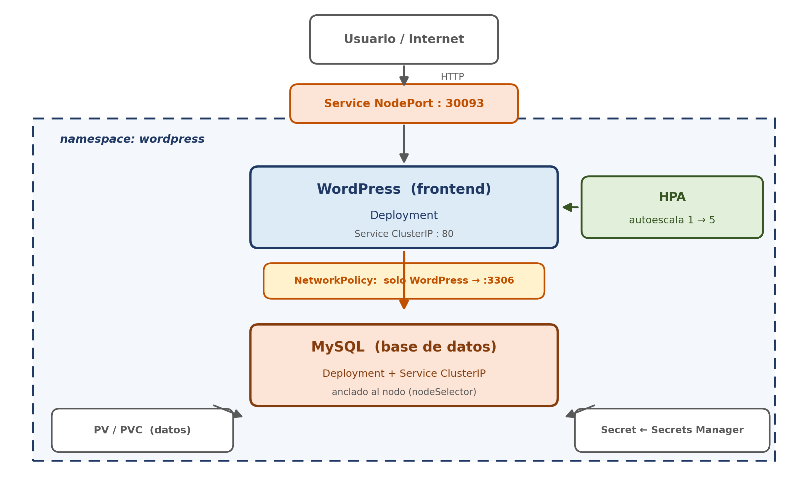

# Act 3.3 — WordPress + MySQL: almacenamiento, secretos, networking y autoscaling

Actividad integradora de cierre de la EA3. Desplegarás una aplicación real de
dos capas (WordPress + MySQL) en Kubernetes, aplicando todo lo aprendido:
gestión de secretos, almacenamiento persistente, acceso externo, aislamiento de
red y escalado automático.

## Arquitectura



El frontend WordPress es accesible desde Internet por un Service NodePort y se
escala automáticamente con un HPA. La base de datos MySQL es interna
(ClusterIP), persiste sus datos en un PV/PVC anclado a un nodo, y queda
protegida por una NetworkPolicy que solo permite el acceso desde WordPress. Las
credenciales provienen de AWS Secrets Manager. Todo vive en el namespace
`wordpress`.

## Manifiestos

| Archivo | Objeto | Qué hace |
|---|---|---|
| `01-namespace.yaml` | Namespace | aísla la app en `wordpress` |
| `02-mysql-secret-from-sm.sh` | (script) | crea el secreto en **AWS Secrets Manager** y genera el Secret de K8s desde él |
| `03-mysql-storage.yaml` | PV + PVC | almacenamiento persistente (`hostPath`) para MySQL |
| `04-mysql.yaml` | Deployment + Service | base de datos MySQL (ClusterIP, interno) |
| `05-wordpress.yaml` | Deployment + Service | frontend WordPress (NodePort 30093) |
| `06-wordpress-hpa.yaml` | HorizontalPodAutoscaler | escala WordPress por CPU |
| `07-networkpolicy.yaml` | NetworkPolicy | solo WordPress puede hablar con MySQL |
| `08-stress-test.sh` | (script) | genera carga para experimentar el autoscaling |

## Requisitos previos

```bash
# El cluster debe estar creado. El script habilita el enforcement de
# NetworkPolicy. El Metrics Server lo instalarás tú en la Fase 5.
bash commons/scripts/create-cluster.sh
```

## Fase 1 — Gestión de secretos con AWS Secrets Manager

En vez de versionar las contraseñas en un YAML (mala práctica), las guardamos en
AWS Secrets Manager y desde ahí generamos el Secret de Kubernetes.

```bash
# Crea el namespace primero
kubectl apply -f act33/manifests/01-namespace.yaml

# Crea el secreto en Secrets Manager y el Secret de K8s a partir de él
bash act33/manifests/02-mysql-secret-from-sm.sh

# Verifica
kubectl get secret mysql-secret -n wordpress
```

> **En producción esto se hace distinto.** El principio que aplicas aquí es
> correcto (las credenciales viven fuera del repositorio, en Secrets Manager),
> pero el mecanismo —leer con la CLI y crear el Secret a mano— es una
> simplificación. En producción se usa el **External Secrets Operator** o el
> **Secrets Store CSI Driver**, que sincronizan Secrets Manager con Kubernetes
> automáticamente (reflejan la rotación de credenciales sin intervención
> manual). Ambos requieren IRSA (roles IAM para service accounts), no disponible
> en el Learner Lab. Además, un Secret de Kubernetes solo está codificado en
> base64, no cifrado: en producción se cifra etcd en reposo con KMS.

## Fase 2 — Almacenamiento persistente

```bash
# 1. Etiqueta UN nodo para anclar el Pod de MySQL.
#    El Deployment de MySQL usa nodeSelector: el Pod correra SIEMPRE en este
#    nodo (donde vive su volumen), para encontrar sus datos tras un reinicio.
NODO=$(kubectl get nodes -o jsonpath='{.items[0].metadata.name}')
kubectl label node "$NODO" mysql-node=true

# 2. Crea el PV (hostPath) y el PVC
kubectl apply -f act33/manifests/03-mysql-storage.yaml

# El PVC debe quedar en estado Bound
kubectl get pvc -n wordpress
```

> **Almacenamiento en este laboratorio:** usamos un volumen `hostPath` (un
> directorio del disco de un nodo, creado automáticamente con
> `DirectoryOrCreate`). El Pod de MySQL se ancla a ese nodo con un
> `nodeSelector`, de modo que siempre se programa en el mismo nodo y conserva
> sus datos entre reinicios. En **producción** una base de datos usaría **EBS**
> (ReadWriteOnce, el volumen sigue al Pod entre nodos) y el contenido
> compartido entre réplicas usaría **EFS** (ReadWriteMany). EBS y EFS requieren
> permisos IAM o configuración de red no disponibles en el Learner Lab.

## Fase 3 — Desplegar MySQL y WordPress

```bash
# Base de datos (consume el Secret y monta el PVC)
kubectl apply -f act33/manifests/04-mysql.yaml

# Frontend (se conecta a MySQL por el Service "mysql")
kubectl apply -f act33/manifests/05-wordpress.yaml

# Espera a que ambos Pods estén Running
kubectl get pods -n wordpress -w
```

Acceder a WordPress desde el navegador:

```bash
# Abre el puerto 30093 en el Security Group de los nodos (automático)
bash commons/scripts/open-nodeport.sh 30093

# Obtén la IP pública de un nodo
kubectl get nodes -o wide
# Abre en el navegador: http://<EXTERNAL-IP>:30093
```

## Fase 4 — Aislamiento de red con NetworkPolicy

```bash
# Solo WordPress podrá conectarse a MySQL (puerto 3306)
kubectl apply -f act33/manifests/07-networkpolicy.yaml
kubectl describe networkpolicy mysql-allow-wordpress -n wordpress
```

## Fase 5 — Autoscaling bajo carga

```bash
# 1. Instala el Metrics Server (provee las métricas de CPU que necesita el HPA).
#    NO viene instalado en un cluster EKS recién creado.
kubectl apply -f https://github.com/kubernetes-sigs/metrics-server/releases/latest/download/components.yaml
sleep 60
kubectl top pods -n wordpress     # debe responder con CPU/memoria por Pod

# 2. Aplica el HPA (escala WordPress de 1 a 5 réplicas según CPU)
kubectl apply -f act33/manifests/06-wordpress-hpa.yaml
kubectl get hpa -n wordpress      # debe mostrar "cpu: X%/50%", no <unknown>

# Genera carga para disparar el escalado
bash act33/manifests/08-stress-test.sh

# Observa el autoscaling en vivo (en otra terminal)
kubectl get hpa -n wordpress -w
kubectl get pods -n wordpress -l app=wordpress -w

# Detén la carga al terminar
bash act33/manifests/08-stress-test.sh stop
```

## Verificación general

```bash
kubectl get all -n wordpress
kubectl get pvc,pv -n wordpress
kubectl top pods -n wordpress
```

## Al terminar — OBLIGATORIO

```bash
bash commons/scripts/delete-cluster.sh
```

> El secreto en AWS Secrets Manager persiste entre sesiones. Puedes conservarlo
> para la próxima clase o eliminarlo (el script de borrado del cluster te
> recuerda el comando).
